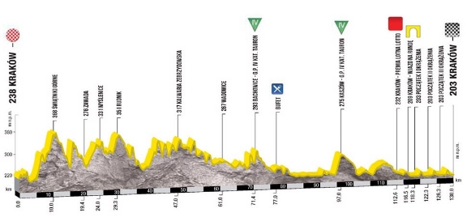

Metody Numeryczne – Zad 3

dr inż. Łukasz Kuszner, ETI PG

**Aproksymacja profilu wysokościowego**

Profil wysokościowy (profil topograficzny) trasy to wykres przedstawiający wysokość bezwzględną w terenie w zależności od odległości punktu od początku trasy. Profil taki może być użyteczny na przykład uczestnikom wyścigu kolarskiego albo turystom planu- jącym wycieczkę (zob. serwis Google Maps w wersji dla rowerzystów).

Rysunek 1: Profil wysokościowy jednej z tras Tour de Pologne. https://rowery.org/2017/07/27/prezentacja-tour-de-pologne-2017/

Znając wysokość tylko części punktów trasy możemy określić wysokości punktów pośrednich za pomocą aproksymacji interpolacyjnej.

**Zadanie**

Dla wybranej trasy zastosuj metody aproksymacji interpolacyjnej omawiane na wykła- dzie:

- metodę wykorzystującą wielomian interpolacyjny Lagrange’a,
- oraz metodę wykorzystującą funkcje sklejane trzeciego stopnia.

Zweryfikuj przydatność obu metod do tego zagadnienia.

**Dane**

Do weryfikacji obu metod proszę użyć danych rzeczywistych, a do obliczeń pewnego ich podzbioru. Można je pobrać na przykład z serwisu [geocontext.org](geocontext.org) lub bezpośrednio z [Google Maps API ](https://developers.google.com/maps/documentation/javascript/elevation?hl=pl)albo innych serwisów oferujących dane geograficzne.

Tras wybranych do testów powinno być kilka (nie więcej niż 5) i powinny one mieć zróżnicowany charakter, na przykład: trasa prawie płaska bez różnic wysokości, trasa o jednym wyraźnym wzniesieniu, trasa o wielu stromych wzniesieniach itp.

**Sprawozdanie**

Przykładowe aspekty obu metod, które mogą okazać się interesujące przy badaniu ich przydatności:

- Wpływ liczby punktów węzłowych na wyniki.
- Wpływ rozmieszczenia punktów węzłowych na wyniki.
- Wpływ dokładności pomiaru punktów węzłowych na wyniki.
- Wpływ charakteru trasy na wyniki.
- Inne według własnej inwencji.

**Zasady punktacji projektu 3**

**Piotr Sypek**

Punktacja za sprawozdanie z projektu 3:

1. wstęp z krótkim opisem stosowanych w obliczeniach metod: jeden punkt,
1. analiza podstawowa interpolacji wielomianowej pierwszej trasy: 1,6 punktu,
1. analiza podstawowa interpolacji wielomianowej drugiej trasy: 1,6 punktu,
1. analiza podstawowa interpolacji funkcjami sklejanymi pierwszej trasy: 1,6 punktu,
1. analiza podstawowa interpolacji funkcjami sklejanymi drugiej trasy: 1,6 punktu,
1. analiza dodatkowa interpolacji: 1,6 punktu,
1. podsumowanie zawierające wnioski z przeprowadzonej analizy: jeden punkt.

Analiza podstawowa oznacza zbadanie wpływu liczby węzłów na interpolację. Analiza dodatkowa powinna przedstawić wpływ innych parametrów niż liczba węzłów na interpolację. Każda analiza podstawowa oraz analiza dodatkowa powinny zawierać co najmniej **cztery wykresy**. Każdy z tych wykresów powinien przedstawiać:

- dane oryginalne,
- wartość danych w węzłach interpolacji,
- interpolację.

Wykresy powinny posiadać legendę, opis osi oraz tytuł informujący m.in. o rodzaju interpolacji oraz liczbie węzłów interpolacji.

Pojedyncza analiza interpolacji polega na przedstawieniu odpowiednich wykresów oraz ich pisemnej interpretacji.

Podsumowując, minimalna liczba wykresów, które powinno zawierać sprawozdanie ocenione na 10 punktów, wynosi **20**. Każdy wykres mniej oznacza 0,4 punktu mniej za sprawozdanie. Liczba wykresów może być większa, jeśli autorka/autor sprawozdania uzna to za zasadne. Oczywiście, dla tego projektu mają zastosowanie również informacje przedstawione w pliku.
